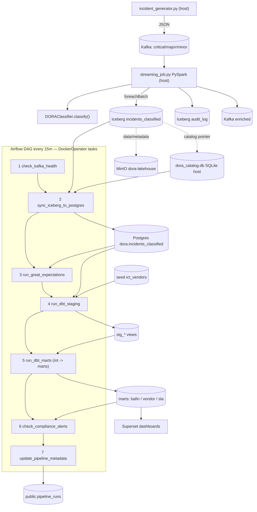

# Architecture — DORA ICT Incident Intelligence Pipeline

End-to-end view of how data flows through the pipeline and how the components connect.

## Data flow

## Stages

1. **Ingestion (host):** `incident_generator.py` produces synthetic `IncidentEvent` JSON to the
   `dora.incidents.{critical,major,minor}` Kafka topics.
2. **Stream processing (host):** `streaming_job.py` (PySpark) reads the topics, applies
   `DORAClassifier.classify()`, stamps audit metadata, and writes via `foreachBatch` to Iceberg
   (`incidents_classified` + `audit_log`) and the `dora.incidents.enriched` topic.
3. **Lakehouse storage:** Apache Iceberg — table data/metadata in **MinIO**
   (`s3://dora-lakehouse/iceberg`); the catalog pointer is a local **SQLite** file
   (`dora_catalog.db`). This shared SQLite catalog is why the Airflow runner bind-mounts the host repo.
4. **Orchestration (Airflow, every 15 min):** each of the 7 tasks runs in the
   `dora/pipeline-runner` container (DockerOperator) — sync Iceberg→Postgres, Great Expectations,
   dbt staging → intermediate → marts, compliance alerting, and run-metadata logging.
5. **Serving:** PostgreSQL marts (`mart_bafin_report`, `mart_vendor_risk`, `mart_sla_breach`)
   feed the **Superset** "DORA Regulatory Compliance Dashboard".

## Why DockerOperator (Option B)

Airflow 2.8 pins `SQLAlchemy<2.0`, but PyIceberg's SqlCatalog needs `>=2.0`, so the heavy
pipeline tools (pyiceberg/pandas/dbt/Great Expectations/confluent-kafka) cannot live in Airflow's
own environment. Every DAG task therefore runs a command inside a separate `dora/pipeline-runner`
image — which also maps 1:1 to a production KubernetesPodOperator.

## Component status

| Stage | Component | Status |
|---|---|---|
| Ingestion | `incident_generator.py` (host) | ✅ |
| Stream + classify | `streaming_job.py` + `DORAClassifier` (host) | ✅ |
| Storage | Iceberg on MinIO + SQLite catalog | ✅ |
| Transform | dbt staging → intermediate → marts | ✅ |
| Data quality | Great Expectations suite | ✅ |
| Orchestration | Airflow DAG via DockerOperator | ✅ |
| Serving | Superset compliance dashboard | ✅ |
