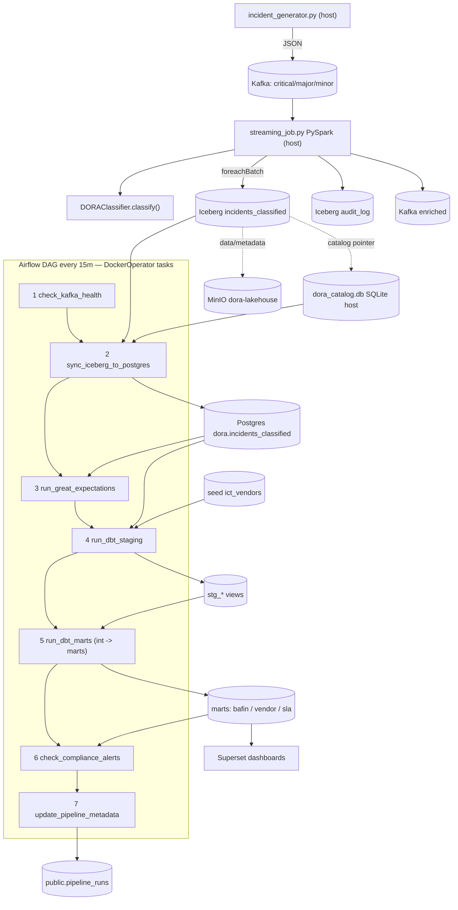
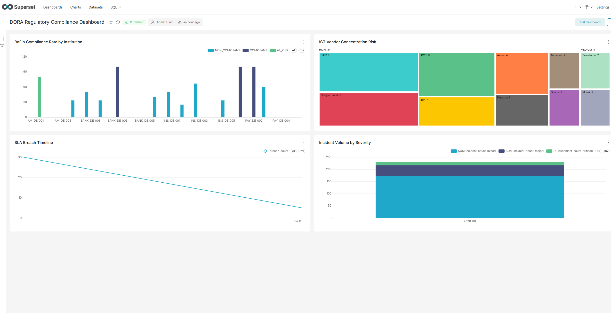
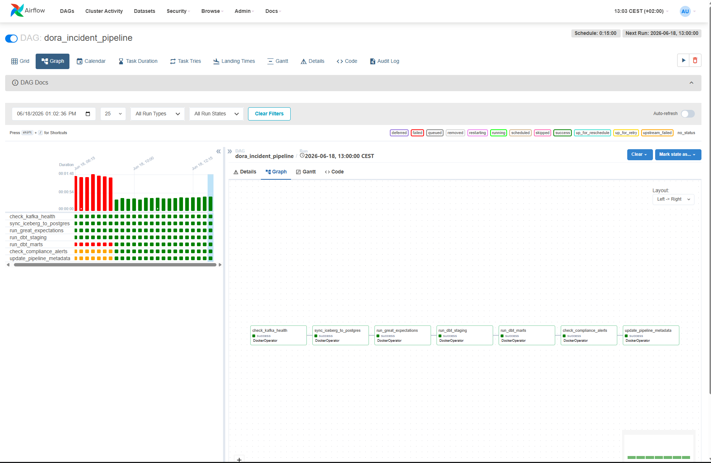
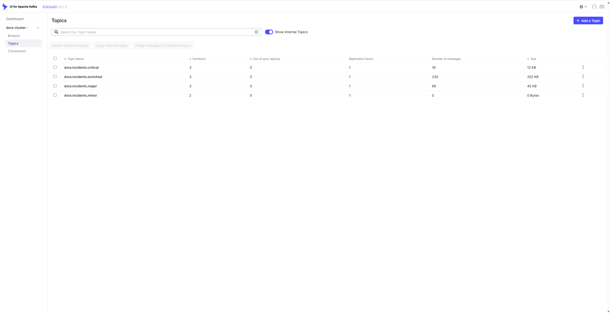
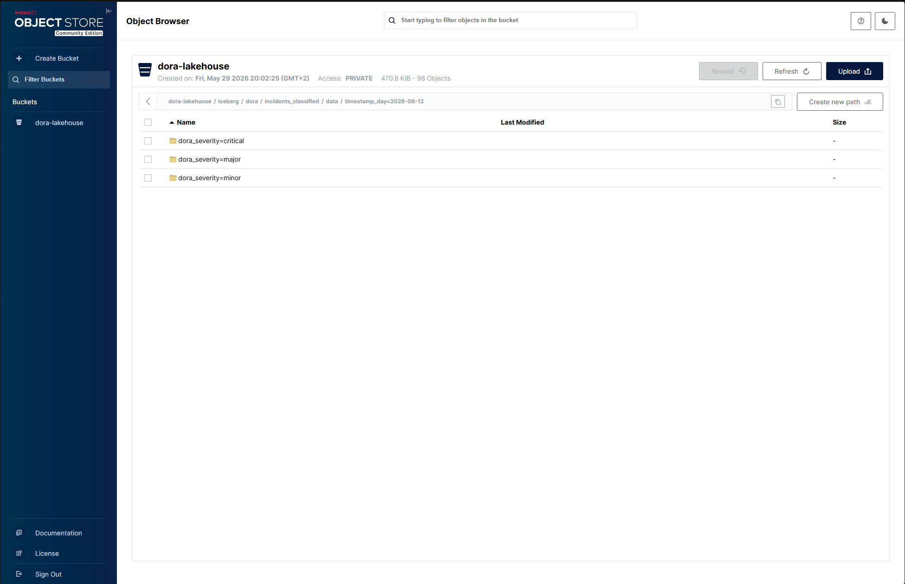

# DORA ICT Incident Intelligence Pipeline

> A production-grade, end-to-end data engineering pipeline that ingests, classifies,
> and reports ICT operational incidents in real time — built to the compliance
> requirements of the EU Digital Operational Resilience Act (DORA), Article 18.

---

## What is DORA?

The **Digital Operational Resilience Act (DORA)** is an EU regulation (effective January 2025)
that requires financial institutions operating in Germany and the EU to detect, classify,
and report ICT (Information and Communication Technology) incidents to their national regulator
(BaFin in Germany) within strict time windows.

Three severity tiers, each with a reporting deadline:

| Severity | Trigger condition | BaFin deadline |
|---|---|---|
| **CRITICAL** | ≥25% clients affected, or ≥€1M financial impact, or cyber attack with ≥10% clients | **4 hours** |
| **MAJOR** | ≥10% clients affected, or ≥€100K impact, or third-party outage | **72 hours** |
| **MINOR** | Everything else | Internal log only |

Missing these deadlines is a regulatory violation. This pipeline automates the detection,
classification, and reporting so that no incident slips through.

---

## What This Project Builds

A **fully local, containerised data pipeline** that simulates the ICT incident lifecycle
from raw event generation through to a compliance dashboard — using the same tools and
patterns you would use in a production financial institution.

### Data Flow



> The diagram above renders on GitHub and in VS Code's Markdown preview. See
> **[ARCHITECTURE.md](ARCHITECTURE.md)** for the same diagram plus a stage-by-stage walkthrough.
> An ASCII fallback follows for plain-text viewers.

```
┌─────────────────────────────────────────────────────────────────────────┐
│                        DORA Pipeline — Data Flow                        │
└─────────────────────────────────────────────────────────────────────────┘

  [Incident Simulator]
  (Python / Pydantic)
        │  synthetic ICT incidents
        ▼
  [Apache Kafka]  ──── dora.incidents.enriched
  4 topics:            dora.incidents.critical
  critical/major/      dora.incidents.major
  minor/enriched       dora.incidents.minor
        │
        ▼
  [PySpark Structured Streaming]
  + DORA Classifier (rules engine)
  + Enrichment (vendor metadata)
        │  classified + enriched events
        ▼
  [Apache Iceberg tables]  ←──── stored in ────►  [MinIO / dora-lakehouse]
  (SqlCatalog → SQLite)                             S3-compatible object store
        │
        ▼
  [dbt Core]
  staging → intermediate → marts
  + Great Expectations quality checks
        │  clean, tested analytical tables
        ▼
  [PostgreSQL]
  mart_bafin_report
  mart_vendor_risk
  mart_sla_breach
        │
        ▼
  [Apache Superset]
  Compliance dashboards
  BaFin report export

  ─────────────────────────────────────────────────
  [Apache Airflow]  ←── orchestrates dbt runs, quality checks, alerting
```

---

## Screenshots

> Save each image under `docs/images/` with the exact filename shown below and the
> links will render automatically (locally and on GitHub).

### DORA Regulatory Compliance Dashboard (Superset)

The four compliance panels — BaFin compliance rate by institution, ICT vendor
concentration-risk treemap, SLA-breach timeline, and incident volume by severity.



### Pipeline Orchestration (Airflow)

The 7-task DAG: Kafka health → Iceberg→Postgres sync → Great Expectations →
dbt staging → dbt marts → compliance alerts → run metadata.



### Real-Time Incident Stream (Kafka UI)

The severity-tiered topics carrying live incident events.



### Iceberg Lakehouse (MinIO)

The `dora-lakehouse` bucket holding the Iceberg table data and metadata.



---

## Tech Stack

| Layer | Technology | Why this choice |
|---|---|---|
| **Ingestion** | Apache Kafka (Confluent 7.5) | Industry-standard event streaming; dot-separated topic naming matches DORA severity tiers |
| **Schema** | Pydantic v2 | Runtime-validated `IncidentEvent` model — single source of truth for all field names |
| **Stream Processing** | PySpark Structured Streaming | Python-native, same API as batch; simpler than Flink for this use case |
| **Table Format** | Apache Iceberg | Schema evolution, time-travel, partitioning by severity + date; better local MinIO support than Delta Lake |
| **Object Storage** | MinIO | Free, S3-compatible, same `boto3` API as real AWS — swap endpoint URL to go to production |
| **Catalog** | Iceberg SqlCatalog (SQLite) | No extra catalog service to run — pointer DB is a local SQLite file; table data/metadata live in MinIO (PyIceberg has no HadoopCatalog) |
| **Transformation** | dbt Core | SQL-based lineage from raw → staging → intermediate → marts; tested models |
| **Data Quality** | Great Expectations | Validates that no incident arrives with null severity or out-of-range fields |
| **Orchestration** | Apache Airflow 2.8 | Schedules dbt runs and quality checks; LocalExecutor keeps it single-node |
| **Database** | PostgreSQL 15 | Shared by Airflow (metadata) and dbt (mart target); avoids a second DB service |
| **Dashboard** | Apache Superset | Self-hosted BI layer; connects directly to PostgreSQL marts |
| **Infrastructure** | Docker Compose | Zero cloud cost during development; fully reproducible on any machine |

---

## Project Phases

| Phase | Description | Status |
|---|---|---|
| **0** | Folder structure scaffold | ✅ Complete |
| **1** | Infrastructure — Docker stack, Kafka topics, MinIO setup | ✅ Complete |
| **2** | Simulator & Schema — `IncidentEvent` model, Kafka producer | ✅ Complete |
| **3** | DORA Classifier — BaFin Article 18 rules engine + unit tests | ✅ Complete |
| **4** | Streaming Job — PySpark consumer, Iceberg writer, enrichment | ✅ Complete |
| **5** | dbt & Data Quality — staging/intermediate/mart models, GE suite | ✅ Complete |
| **6** | Airflow Orchestration — 7-task pipeline DAG (DockerOperator) | ✅ Complete |
| **7** | Dashboard — Superset compliance dashboard | ✅ Complete |
| **8** | Packaging — docs, architecture diagram | ✅ Complete |

---

## Prerequisites

- **Docker Desktop** (v4.x+) — all services run in containers
- **Python 3.11** — for host-side scripts (simulator, setup scripts)
- **Git**

Python packages (Phases 1–3 active):

```bash
python -m venv .venv
.\.venv\Scripts\Activate.ps1        # Windows PowerShell
# source .venv/bin/activate          # macOS / Linux
pip install -r requirements.txt
```

Phase 4+ packages (`pyspark`, `pyiceberg`, `dbt-postgres`, `apache-airflow`) are commented stubs in `requirements.txt` — uncomment when starting that phase.

---

## Quick Start

### 1 — Clone and configure

```bash
git clone https://github.com/Chirag-Kathuria-009/dora-incident-pipeline.git
cd dora-incident-pipeline

cp .env.example .env
```

Open `.env` and fill in the two generated secrets:

```bash
# Generate Airflow Fernet key (required — Airflow will not start without it)
python -c "from cryptography.fernet import Fernet; print(Fernet.generate_key().decode())"

# Generate random secret keys for Airflow webserver and Superset
python -c "import secrets; print(secrets.token_hex(32))"
```

Paste the outputs into `AIRFLOW_FERNET_KEY`, `AIRFLOW_SECRET_KEY`, and `SUPERSET_SECRET_KEY`
in your `.env`. All other values work as-is for local development.

### 2 — Start the stack

```bash
docker compose up -d

# Wait until these three report (healthy):
docker compose ps
```

Expected healthy services: `dora-kafka`, `dora-postgres`, `dora-minio`

### 3 — Bootstrap Kafka topics and MinIO storage

```bash
# Creates 4 Kafka topics with correct partition counts and retention policies
python ingestion/kafka/topics_setup.py

# Creates dora-lakehouse bucket and folder prefixes in MinIO
python storage/s3_config.py
```

Both scripts are **idempotent** — safe to run multiple times.

### 4 — Verify everything is working

| Service | URL | Credentials |
|---|---|---|
| Kafka UI | http://localhost:8080 | — |
| MinIO Console | http://localhost:9001 | minioadmin / minioadmin |
| Airflow | http://localhost:8082 | admin / admin |
| Superset | http://localhost:8088 | admin / admin |

---

## Project Structure

```
dora-incident-pipeline/
│
├── docker-compose.yml              # Full 7-service local stack
├── .env.example                    # All required environment variables (copy to .env)
│
├── ingestion/
│   ├── simulator/
│   │   ├── schema.py               # IncidentEvent Pydantic model — source of truth for all field names
│   │   └── incident_generator.py   # Synthetic event producer → Kafka
│   └── kafka/
│       └── topics_setup.py         # Creates 4 DORA Kafka topics (idempotent)
│
├── processing/
│   ├── dora_classifier.py          # BaFin Article 18 rules engine → CRITICAL / MAJOR / MINOR
│   ├── streaming_job.py            # PySpark Structured Streaming consumer + Iceberg writer
│   └── enrichment.py               # Adds vendor metadata and human-readable severity labels
│
├── storage/
│   ├── s3_config.py                # Reusable boto3 MinIO client + bucket/folder bootstrap
│   └── iceberg_tables.py           # PyIceberg table definitions (SqlCatalog/SQLite, data on MinIO)
│
├── transform/
│   ├── dbt_project/
│   │   ├── models/staging/         # stg_incidents — cast and rename raw Iceberg columns
│   │   ├── models/intermediate/    # int_dora_classified — add BaFin notification deadlines
│   │   └── models/marts/           # mart_bafin_report · mart_vendor_risk · mart_sla_breach
│   └── great_expectations/
│       └── expectations/           # Data quality suite — validates incident field constraints
│
├── orchestration/
│   ├── pipeline_steps.py           # CLI for the 4 Python DAG steps (run inside the runner container)
│   └── dags/
│       └── dora_pipeline_dag.py    # Main 7-task Airflow DAG (DockerOperator — Option B)
│
├── dashboard/
│   └── superset_config.py          # Superset Flask runtime config + REST-API dashboard bootstrap
│
├── Dockerfile.runner               # dora/pipeline-runner image — runs every DAG task's heavy deps
├── Dockerfile.superset             # apache/superset + psycopg2-binary (reads the PG marts)
├── requirements.txt                # Pipeline deps
├── requirements-airflow.txt        # Airflow-only deps for the DAG test venv (avoids the SQLAlchemy clash)
│
└── tests/
    ├── test_classifier.py          # Unit tests covering every DORA classification boundary
    ├── test_dag.py                 # Static Airflow DAG validation (7 tasks, deps, schedule, retries)
    ├── e2e_smoke_test.py           # Standalone ingestion → streaming → Iceberg smoke test
    ├── test_generator.py           # Incident generator and schema validation tests (stub)
    └── test_dbt_models.py          # dbt model integration tests (stub)
```

---

## MinIO Storage Layout

Bucket `dora-lakehouse` is the single storage layer for both raw events and Iceberg tables:

```
dora-lakehouse/
├── raw/incidents/       # JSON landing zone — raw Kafka events before Iceberg ingest
└── iceberg/             # PyIceberg SqlCatalog warehouse root
    └── dora/            # namespace 'dora'
        ├── incidents_raw/         # data/ + metadata/ for the raw incidents table
        ├── incidents_classified/  # partitioned by day → severity (see below)
        │   ├── data/timestamp_day=YYYY-MM-DD/dora_severity=critical/*.parquet
        │   ├── data/timestamp_day=YYYY-MM-DD/dora_severity=major/*.parquet
        │   └── data/timestamp_day=YYYY-MM-DD/dora_severity=minor/*.parquet
        └── audit_log/             # data/ (partitioned by processed_at_day) + metadata/
```

> The Iceberg **catalog pointer** is not stored in MinIO — it lives in a local
> SQLite file (`dora_catalog.db`, gitignored). Only the table data and metadata
> files live in MinIO.

---

## Kafka Topics

| Topic | Partitions | Retention | Purpose |
|---|---|---|---|
| `dora.incidents.critical` | 3 | 7 days | CRITICAL classified events awaiting BaFin notification |
| `dora.incidents.major` | 3 | 7 days | MAJOR classified events |
| `dora.incidents.minor` | 2 | 3 days | MINOR events (internal log only) |
| `dora.incidents.enriched` | 3 | 30 days | All events post-enrichment (full audit trail) |

---

## DORA Classification Rules (BaFin Article 18)

The rules engine in `processing/dora_classifier.py` evaluates these conditions in priority order:

**CRITICAL** — notify BaFin within 4 hours if any condition is true:
- `clients_affected_pct >= 25%`
- `financial_impact_eur >= €1,000,000`
- `cyber_attack = true` AND `clients_affected_pct >= 10%`
- `cross_border = true` AND `clients_affected_pct >= 10%`

**MAJOR** — notify BaFin within 72 hours (only if not already CRITICAL):
- `clients_affected_pct >= 10%`
- `financial_impact_eur >= €100,000`
- `third_party_provider` is set AND `incident_type = "system_outage"`

**MINOR** — internal log only, no BaFin notification required.

---

## Key Design Decisions

See **[ARCHITECTURE.md](ARCHITECTURE.md)** for the full data flow. Key decisions:

- **Iceberg over Delta Lake** — PyIceberg has better local MinIO support
- **SqlCatalog (SQLite) over HadoopCatalog** — PyIceberg ships no HadoopCatalog; SQLite-backed SqlCatalog keeps the "no extra service" goal (data still in MinIO)
- **PySpark over Flink** — simpler Python integration; adequate throughput for DORA event scale
- **PostgreSQL shared** — used by both Airflow (metadata) and dbt (mart target) to avoid a second DB
- **Airflow runs each task in a container (DockerOperator)** — Airflow 2.8 pins SQLAlchemy `<2.0` while PyIceberg needs `>=2.0`, so the pipeline deps run in a separate `dora/pipeline-runner` image (also maps 1:1 to a prod KubernetesPodOperator)
- **Superset metadata uses SQLite**, but the image is extended with `psycopg2-binary` (`Dockerfile.superset`) so it can read the PostgreSQL marts as a data source
- **100% Docker Compose** — zero cloud cost, fully reproducible on any reviewer's machine

---

## Contributing / Extending

This project is built phase by phase with a clear quality gate at each phase:

```bash
# Phase 3 gate — all 8 classifier unit tests must pass
pytest tests/test_classifier.py -v

# Phase 5 gate — dbt models must pass all schema tests
dbt test --select staging
dbt run --select marts

# Phase 6 gate — Airflow DAG structure tests 
pytest tests/test_dag.py -v

# Full suite
pytest tests/ -v
```

---

## License

MIT

